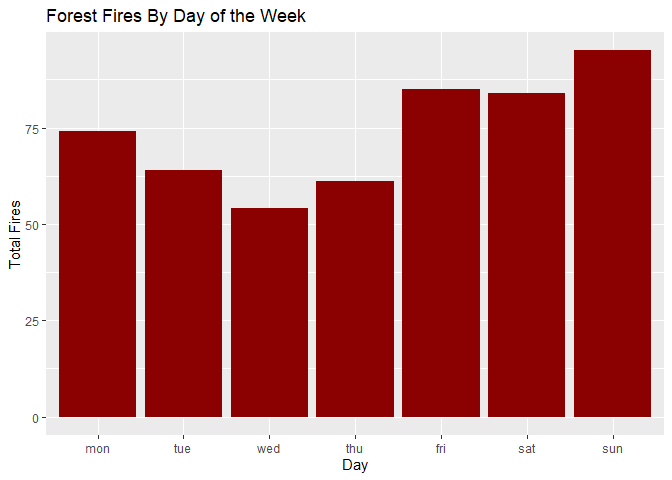

Data Visualization: Analyzing Forest Fires
================
RPrice
2023-01-18

This project will use data from a study entitled “A Data Mining Approach
to Predict Forest Fires using Meteorological Data” ([Cortez & Morais,
2007](https://www.researchgate.net/publication/238767143_A_Data_Mining_Approach_to_Predict_Forest_Fires_using_Meteorological_Data)).
The data are available
[here](https://archive.ics.uci.edu/ml/machine-learning-databases/forest-fires/).

# Initializing

``` r
rm(list=ls())
```

    ## ── Attaching packages ─────────────────────────────────────── tidyverse 1.3.2 ──
    ## ✔ ggplot2 3.4.0      ✔ purrr   1.0.1 
    ## ✔ tibble  3.1.8      ✔ dplyr   1.0.10
    ## ✔ tidyr   1.2.1      ✔ stringr 1.5.0 
    ## ✔ readr   2.1.3      ✔ forcats 0.5.2 
    ## ── Conflicts ────────────────────────────────────────── tidyverse_conflicts() ──
    ## ✖ dplyr::filter() masks stats::filter()
    ## ✖ dplyr::lag()    masks stats::lag()

Reading in the data

``` r
forestfires <- read_csv("forestfires.csv", show_col_types = FALSE)
```

``` r
head(forestfires)
```

    ## # A tibble: 6 × 13
    ##       X     Y month day    FFMC   DMC    DC   ISI  temp    RH  wind  rain  area
    ##   <dbl> <dbl> <chr> <chr> <dbl> <dbl> <dbl> <dbl> <dbl> <dbl> <dbl> <dbl> <dbl>
    ## 1     7     5 mar   fri    86.2  26.2  94.3   5.1   8.2    51   6.7   0       0
    ## 2     7     4 oct   tue    90.6  35.4 669.    6.7  18      33   0.9   0       0
    ## 3     7     4 oct   sat    90.6  43.7 687.    6.7  14.6    33   1.3   0       0
    ## 4     8     6 mar   fri    91.7  33.3  77.5   9     8.3    97   4     0.2     0
    ## 5     8     6 mar   sun    89.3  51.3 102.    9.6  11.4    99   1.8   0       0
    ## 6     8     6 aug   sun    92.3  85.3 488    14.7  22.2    29   5.4   0       0

The variables are described in the paper.

``` r
variable_matrix <- matrix(c("X", "x-axis coordinate (from 1 to 9)", "Y", "y-axis coordinate (from 1 to 9)", "month", "Month of the year (January to December)", "day", "Day of the week (Monday to Sunday)", "FFMC", "Fine fuel moisture code", "DMC", "Duff moisture code", "DC", "Drought code", "ISI", "Initial speed index", "temp", "Outside temperature (in ◦C)", "RH", "Outside relative humidity (in %)", "wind", "Outside wind speed (in km/h)", "rain", "Outside rain (in mm/m2)", "area", "Total burned area (in ha)"), ncol=2, byrow=TRUE)
colnames(variable_matrix) <- c("Variable", "Description")
rownames(variable_matrix) <- c(1:nrow(variable_matrix))
variable_table <- as.table(variable_matrix)
kable(variable_table)
```

| Variable | Description                             |
|:---------|:----------------------------------------|
| X        | x-axis coordinate (from 1 to 9)         |
| Y        | y-axis coordinate (from 1 to 9)         |
| month    | Month of the year (January to December) |
| day      | Day of the week (Monday to Sunday)      |
| FFMC     | Fine fuel moisture code                 |
| DMC      | Duff moisture code                      |
| DC       | Drought code                            |
| ISI      | Initial speed index                     |
| temp     | Outside temperature (in ◦C)             |
| RH       | Outside relative humidity (in %)        |
| wind     | Outside wind speed (in km/h)            |
| rain     | Outside rain (in mm/m2)                 |
| area     | Total burned area (in ha)               |

FFMC, DMC, DC, and ISI are from the Canadian Forest Fire Weather Index
(FWI) System, which “consists of six components that account for the
effects of fuel moisture and weather conditions on fire behavior”
([Natural Resources
Canada](https://cwfis.cfs.nrcan.gc.ca/background/summary/fwi)).

# Data Cleaning

Checking the month and day values:

``` r
print(forestfires %>% pull(month) %>% unique)
```

    ##  [1] "mar" "oct" "aug" "sep" "apr" "jun" "jul" "feb" "jan" "dec" "may" "nov"

``` r
print(forestfires %>% pull(day) %>% unique)
```

    ## [1] "fri" "tue" "sat" "sun" "mon" "wed" "thu"

Ordering months:

``` r
month_order <- c("jan", "feb", "mar", "apr", "may", "jun",
                 "jul", "aug", "sep", "oct", "nov", "dec")
forestfires <- forestfires %>% mutate(month = factor(month, levels=month_order))
forestfires %>% pull(month) %>% unique
```

    ##  [1] mar oct aug sep apr jun jul feb jan dec may nov
    ## Levels: jan feb mar apr may jun jul aug sep oct nov dec

Ordering days of the week:

``` r
day_order <- c("mon", "tue", "wed", "thu", "fri", "sat",
                 "sun")
forestfires <- forestfires %>% mutate(day = factor(day, levels=day_order))
forestfires %>% pull(day) %>% unique
```

    ## [1] fri tue sat sun mon wed thu
    ## Levels: mon tue wed thu fri sat sun

# Data Visualization

Two questions: \* In which months do forest fires happen the most? \* On
which days of the week do forest fires happen the most?

## In which months do forest fires happen the most?

Count the number of forest fires per month:

``` r
fires_monthly <- forestfires %>% group_by(month) %>% summarize(count=n())
fires_monthly
```

    ## # A tibble: 12 × 2
    ##    month count
    ##    <fct> <int>
    ##  1 jan       2
    ##  2 feb      20
    ##  3 mar      54
    ##  4 apr       9
    ##  5 may       2
    ##  6 jun      17
    ##  7 jul      32
    ##  8 aug     184
    ##  9 sep     172
    ## 10 oct      15
    ## 11 nov       1
    ## 12 dec       9

Visualization:

``` r
fires_monthly %>% ggplot(aes(x=month, y=count)) +
                         geom_col(fill = "dark red") +
                         labs(title = "Forest Fires Per Month",
                               x = "Month", y = "Total Fires") 
```

<!-- -->

## On which days of the week do forest fires happen the most?

Count the number of forest fires per day:

``` r
fires_daily <- forestfires %>% group_by(day) %>% summarize(count=n())
fires_daily
```

    ## # A tibble: 7 × 2
    ##   day   count
    ##   <fct> <int>
    ## 1 mon      74
    ## 2 tue      64
    ## 3 wed      54
    ## 4 thu      61
    ## 5 fri      85
    ## 6 sat      84
    ## 7 sun      95

Visualization:

``` r
fires_daily %>% ggplot(aes(x=day, y=count)) +
                         geom_col(fill = "dark red") +
                         labs(
                           title = "Forest Fires By Day of the Week",
                               x = "Day", y = "Total Fires") 
```

<!-- -->
