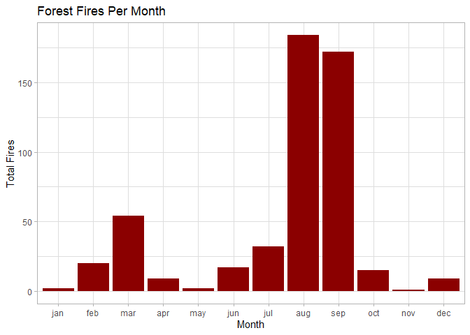
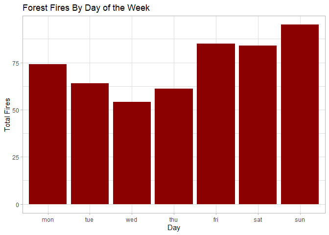
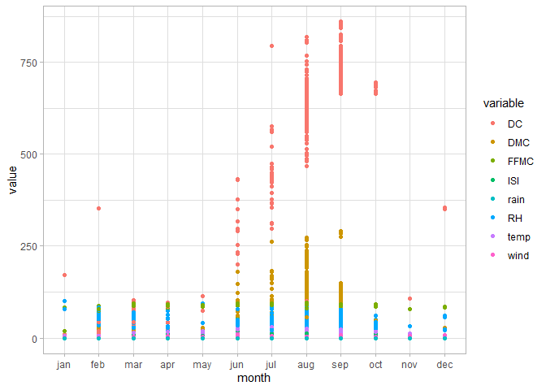
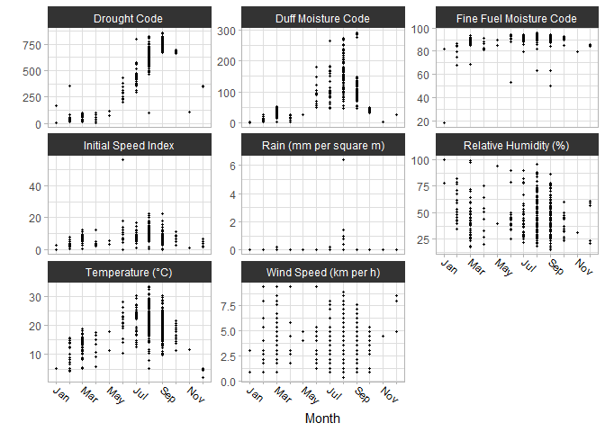
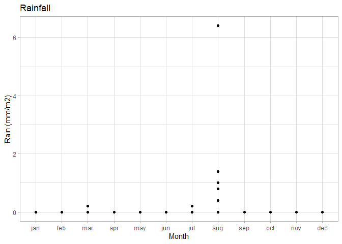
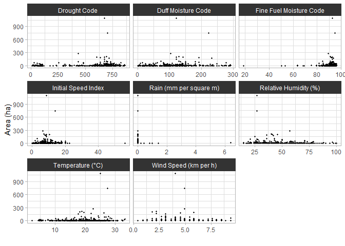
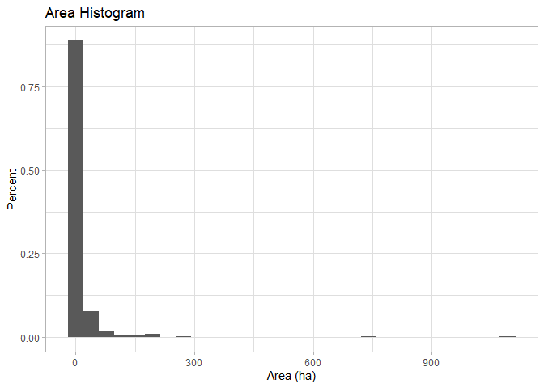
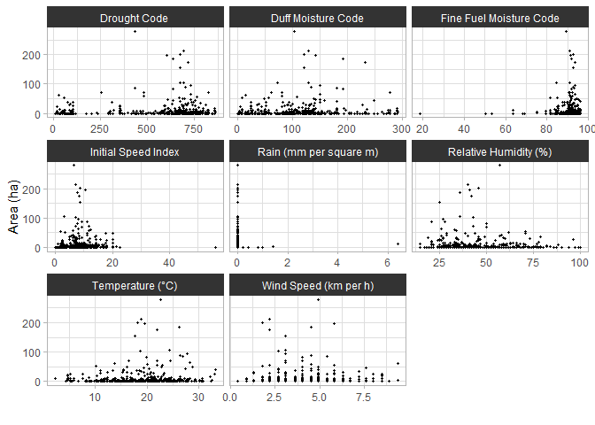

Data Visualization: Analyzing Forest Fires
================
RPrice
2023-01-18

This project will use data from a study entitled “A Data Mining Approach
to Predict Forest Fires using Meteorological Data” ([Cortez & Morais,
2007](https://www.researchgate.net/publication/238767143_A_Data_Mining_Approach_to_Predict_Forest_Fires_using_Meteorological_Data)).
The data were collected in northeast Portugal and are available
[here](https://archive.ics.uci.edu/ml/machine-learning-databases/forest-fires/).

The goal of the project is to use `ggplot2` to create data
visualizations answering four questions:

- In which months do forest fires happen the most?
- On which days of the week do forest fires happen the most?
- Which explanatory variables are associated with more fire incidents?
- Which explanatory variables are associated with more severe fires?

## Initializing

Reading in the data:

``` r
forestfires <- read_csv("forestfires.csv", show_col_types = FALSE)
head(forestfires) %>% kable
```

|   X |   Y | month | day | FFMC |  DMC |    DC |  ISI | temp |  RH | wind | rain | area |
|----:|----:|:------|:----|-----:|-----:|------:|-----:|-----:|----:|-----:|-----:|-----:|
|   7 |   5 | mar   | fri | 86.2 | 26.2 |  94.3 |  5.1 |  8.2 |  51 |  6.7 |  0.0 |    0 |
|   7 |   4 | oct   | tue | 90.6 | 35.4 | 669.1 |  6.7 | 18.0 |  33 |  0.9 |  0.0 |    0 |
|   7 |   4 | oct   | sat | 90.6 | 43.7 | 686.9 |  6.7 | 14.6 |  33 |  1.3 |  0.0 |    0 |
|   8 |   6 | mar   | fri | 91.7 | 33.3 |  77.5 |  9.0 |  8.3 |  97 |  4.0 |  0.2 |    0 |
|   8 |   6 | mar   | sun | 89.3 | 51.3 | 102.2 |  9.6 | 11.4 |  99 |  1.8 |  0.0 |    0 |
|   8 |   6 | aug   | sun | 92.3 | 85.3 | 488.0 | 14.7 | 22.2 |  29 |  5.4 |  0.0 |    0 |

The variables are described in the paper:

``` r
variable_matrix <- matrix(c("X", "x-axis coordinate (from 1 to 9)", "Y", "y-axis coordinate (from 1 to 9)", "month", "Month of the year (January to December)", "day", "Day of the week (Monday to Sunday)", "FFMC", "Fine fuel moisture code", "DMC", "Duff moisture code", "DC", "Drought code", "ISI", "Initial speed index", "temp", "Outside temperature (in ◦C)", "RH", "Outside relative humidity (in %)", "wind", "Outside wind speed (in km/h)", "rain", "Outside rain (in mm/m2)", "area", "Total burned area (in ha)"), ncol=2, byrow=TRUE)
colnames(variable_matrix) <- c("Variable", "Description")
rownames(variable_matrix) <- c(1:nrow(variable_matrix))
variable_table <- as.table(variable_matrix)
kable(variable_table)
```

| Variable | Description                             |
|:---------|:----------------------------------------|
| X        | x-axis coordinate (from 1 to 9)         |
| Y        | y-axis coordinate (from 1 to 9)         |
| month    | Month of the year (January to December) |
| day      | Day of the week (Monday to Sunday)      |
| FFMC     | Fine fuel moisture code                 |
| DMC      | Duff moisture code                      |
| DC       | Drought code                            |
| ISI      | Initial speed index                     |
| temp     | Outside temperature (in ◦C)             |
| RH       | Outside relative humidity (in %)        |
| wind     | Outside wind speed (in km/h)            |
| rain     | Outside rain (in mm/m2)                 |
| area     | Total burned area (in ha)               |

Fine fuel moisture code (FFMC), Duff moisture code (DMC), Drought code
(DC), and Initial speed index (ISI) are from the Canadian Forest Fire
Weather Index (FWI) System, which “consists of six components that
account for the effects of fuel moisture and weather conditions on fire
behavior” ([Natural Resources
Canada](https://cwfis.cfs.nrcan.gc.ca/background/summary/fwi)).
According to the US National Wildfire Coordinating Group, FFMC
represents the fuel moisture of forest litter that is shaded under the
tree canopy (ranges 0 to 101). DMC represents the fuel moisture of of
decomposed organic topsoil under the litter(unitless and open-ended). DC
represents deep-soil drought conditions (unitless, maximum value of
1000, with values 800 and over indicating extreme drought). ISI is a
fire behavior index. It uses wind speed and fuel moisture to estimate a
fire’s spread potential (unitless, open-ended) ([NWCG’s Fire Weather
Index
System](https://www.nwcg.gov/publications/pms437/cffdrs/fire-weather-index-system#TOC-FWI-Fuel-Moisture-Codes)).

## Data Cleaning

Checking the month and day values:

``` r
forestfires %>% pull(month) %>% unique
```

    ##  [1] "mar" "oct" "aug" "sep" "apr" "jun" "jul" "feb" "jan" "dec" "may" "nov"

``` r
forestfires %>% pull(day) %>% unique
```

    ## [1] "fri" "tue" "sat" "sun" "mon" "wed" "thu"

The months and days need to be ordered so that they appear in order on
the plots.

Ordering months:

``` r
month_order <- c("jan", "feb", "mar", "apr", "may", "jun",
                 "jul", "aug", "sep", "oct", "nov", "dec")
forestfires <- forestfires %>% mutate(month = factor(month, levels=month_order))
forestfires %>% pull(month) %>% unique
```

    ##  [1] mar oct aug sep apr jun jul feb jan dec may nov
    ## Levels: jan feb mar apr may jun jul aug sep oct nov dec

Ordering days of the week:

``` r
day_order <- c("mon", "tue", "wed", "thu", "fri", "sat",
                 "sun")
forestfires <- forestfires %>% mutate(day = factor(day, levels=day_order))
forestfires %>% pull(day) %>% unique
```

    ## [1] fri tue sat sun mon wed thu
    ## Levels: mon tue wed thu fri sat sun

## Data Visualization

Plots will be created and interpreted to address each of the four
guiding questions of the project.

Setting the theme for all plots:

``` r
theme_set(theme_light())
#alter the new theme to make headers darker (subplots only)
title_theme <- theme_update(strip.background = element_rect(fill = "grey20", color = "grey20")) 
```

### In which months do forest fires happen the most?

Count the number of forest fires per month:

``` r
fires_monthly <- forestfires %>% group_by(month) %>% summarize(count=n())
fires_monthly %>% kable
```

| month | count |
|:------|------:|
| jan   |     2 |
| feb   |    20 |
| mar   |    54 |
| apr   |     9 |
| may   |     2 |
| jun   |    17 |
| jul   |    32 |
| aug   |   184 |
| sep   |   172 |
| oct   |    15 |
| nov   |     1 |
| dec   |     9 |

Visualization:

``` r
fires_monthly %>% ggplot(aes(x=month, y=count)) +
                         geom_col(fill = "dark red") +
                         labs(title = "Forest Fires Per Month",
                               x = "Month", y = "Total Fires") 
```

<!-- -->

The months with the most forest fires are August and September, with
close to 175 fires.

### On which days of the week do forest fires happen the most?

Count the number of forest fires per day:

``` r
fires_daily <- forestfires %>% group_by(day) %>% summarize(count=n())
fires_daily %>% kable
```

| day | count |
|:----|------:|
| mon |    74 |
| tue |    64 |
| wed |    54 |
| thu |    61 |
| fri |    85 |
| sat |    84 |
| sun |    95 |

Visualization:

``` r
fires_daily %>% ggplot(aes(x=day, y=count)) +
                         geom_col(fill = "dark red") +
                         labs(
                           title = "Forest Fires By Day of the Week",
                               x = "Day", y = "Total Fires") 
```

<!-- -->

There is a slightly higher number of forest fires per day on the
weekends, Friday through Sunday.

### Creating long data

The next two questions require the data to be in a long format.

``` r
forestfires_long <- forestfires %>%
pivot_longer(cols = c(FFMC, DMC, DC, ISI, temp, RH, wind, rain), names_to = "variable", values_to = "value")
```

### Which explanatory variables are associated with more fire incidents?

We will look at the following eight variables each month to examine the
association with the number of fires.

``` r
variable_matrix[5:12, 1:2] %>% kable
```

|     | Variable | Description                      |
|:----|:---------|:---------------------------------|
| 5   | FFMC     | Fine fuel moisture code          |
| 6   | DMC      | Duff moisture code               |
| 7   | DC       | Drought code                     |
| 8   | ISI      | Initial speed index              |
| 9   | temp     | Outside temperature (in ◦C)      |
| 10  | RH       | Outside relative humidity (in %) |
| 11  | wind     | Outside wind speed (in km/h)     |
| 12  | rain     | Outside rain (in mm/m2)          |

Plotting multiple variables:

``` r
forestfires_long %>% ggplot(
  aes(x = month, y = value, color = variable)) +
  geom_point()
```

<!-- -->

The data is too cramped to read on a single plot, so subplots will be
necessary.

Rewriting the labels to be better titles:

``` r
new_titles <- c("Fine Fuel Moisture Code", "Duff Moisture Code", "Drought Code", "Initial Speed Index", "Temperature (°C)", "Relative Humidity (%)", "Wind Speed (km per h)", "Rain (mm per square m)")

names(new_titles) <- c("FFMC", "DMC", "DC", "ISI", "temp", "RH", "wind", "rain")
```

Plot:

``` r
forestfires_long %>% ggplot(
  aes(x = month, y = value)) +
  geom_point(shape = 20) +
  facet_wrap(vars(variable), scales = "free_y", 
             labeller = as_labeller(new_titles)) + #new subplot titles
  scale_x_discrete(labels=c("Jan", "", "Mar", "", "May", "","Jul", "",  
                            "Sep", "", "Nov", "")) + #label 6 months only
  ylab("") + #removing unnecessary "value" label 
  xlab("Month") + # fix capitalization
  theme(axis.text.x = element_text(size=9, angle = -40, vjust = 0.5, hjust = 0, color = "black") # rotate and move x tick labels (months)
        ) 
```

<!-- -->

Recall that DMC and ISI are unitless and open-ended. FFMC ranges from 0
to 101. DC has a maximum value of 1000, with values 800 and above
indicating extreme drought. DC increases steadily throughout the summer,
peaking in September. It looks like the max values are close to the
extreme drought value in August and September. Temperature peaks in
August. Interestingly, DMC, representing the moisture of topsoil,
appears to increase in the warmer months. There is a single very high
rain value in August. Wind speed appears to decrease slightly in the
fall and winter. ISI, related to wind speed but also to fuel moisture,
peaks in August. The variables that may be most closely related to
increased wildfires in August and September are temperature, DC, and
ISI.

#### Examining the rain outlier

Selecting the top five fires with highest rain values:

``` r
forestfires %>% slice_max(rain, n = 5) %>% kable
```

|   X |   Y | month | day | FFMC |   DMC |    DC |  ISI | temp |  RH | wind | rain |  area |
|----:|----:|:------|:----|-----:|------:|------:|-----:|-----:|----:|-----:|-----:|------:|
|   7 |   5 | aug   | tue | 96.1 | 181.1 | 671.2 | 14.3 | 27.3 |  63 |  4.9 |  6.4 | 10.82 |
|   5 |   4 | aug   | fri | 91.0 | 166.9 | 752.6 |  7.1 | 21.1 |  71 |  7.6 |  1.4 |  2.17 |
|   7 |   4 | aug   | sun | 91.8 | 175.1 | 700.7 | 13.8 | 21.9 |  73 |  7.6 |  1.0 |  0.00 |
|   8 |   6 | aug   | tue | 96.1 | 181.1 | 671.2 | 14.3 | 21.6 |  65 |  4.9 |  0.8 |  0.00 |
|   7 |   5 | aug   | tue | 96.1 | 181.1 | 671.2 | 14.3 | 21.6 |  65 |  4.9 |  0.8 |  0.00 |

The maximum rainfall is 6.4 mm/m2, and the next highest value is 1.4. It
is a statistical outlier but is not impossible. The drought code is
still very high for that incident. Making a larger rain graph to see the
values more easily:

``` r
forestfires %>% ggplot(aes(x = month, y = rain)) +
                         geom_point() +
                         labs(title = "Rainfall", x = "Month", y = "Rain (mm/m2)")
```

<!-- -->

The plot shows rain occuring during fire incidents only once in March
and July, and five times in August. There was no rainfall during fires
in any other months. The drought code is highest in the summer months,
making it unlikely that this location experiences regular summer rain.
Britannica indicates that Portugal has variable rainfall, but inland
regions experience summer drought ([Britannica, Climate of
Portugal](https://www.britannica.com/place/Portugal/Climate)). With that
background, the data may indicate that during the winter months,
conditions are wet enough that fires occur only on the driest days.
However, in the summer, drought may be intense enough that fires are
able to establish in dry fuel even during rainfall.

### Which explanatory variables are associated with more severe fires?

Area burned will be used as a proxy for fire severity. The same eight
variables as above will be plotted, this time on the x-axis, with area
as the response variable.

``` r
forestfires_long %>% ggplot(
  aes(x = value, y = area)) +
  geom_point(shape = 20) +
  facet_wrap(vars(variable), scales = "free_x", 
             labeller = as_labeller(new_titles)) + #new subplot titles
  xlab("") + #removing unnecessary "value" label 
  ylab("Area (ha)") 
```

<!-- -->

There is a cluster of small fires with a low DC value, then more fires
and larger fires at higher DC values. For DMC, there are more fires at
lower values; larger fires have moderate values. FFMC demonstrates a
clearer pattern, with most fires clustered between values of 80-100, and
most larger fires have values over 90. Most fires have ISI values
between 0 and 20, and larger fires tend to fall closer to 10. One fire
has a ISI value of 40 and was very small area, close to 0 ha. Most fires
and all large fires had no rainfall. Most fires have moderate RH values,
between 25% and 75%. Fires occurred at most temperatures, but larger
fires occurred above 15°C. Wind speed doesn’t demonstrate an obvious
trend.

Two fires with very high areas burned stand out in each plot. The fires
occurred during high temperature, high DC, and high FFMC conditions.

Looking at the three largest fires:

``` r
forestfires %>% slice_max(area, n = 3) %>% kable
```

|   X |   Y | month | day | FFMC |   DMC |    DC |  ISI | temp |  RH | wind | rain |    area |
|----:|----:|:------|:----|-----:|------:|------:|-----:|-----:|----:|-----:|-----:|--------:|
|   6 |   5 | sep   | sat | 92.5 | 121.1 | 674.4 |  8.6 | 25.1 |  27 |  4.0 |    0 | 1090.84 |
|   8 |   6 | aug   | thu | 94.8 | 222.4 | 698.6 | 13.9 | 27.5 |  27 |  4.9 |    0 |  746.28 |
|   7 |   4 | jul   | mon | 89.2 | 103.9 | 431.6 |  6.4 | 22.6 |  57 |  4.9 |    0 |  278.53 |

The three largest fires burned 1091, 746, and 279 ha. Many fires appear
to have an area of 0 ha.

Taking a look at a histogram:

``` r
forestfires %>% ggplot(aes(x = area)) +
  geom_histogram(aes(y = after_stat(count/sum(count))), binwidth = 39) +
  #percent instead of count
  ylab("Percent") + xlab("Area (ha)") +
  labs(title = "Area Histogram")
```

<!-- -->

Over 80% of fires have an area of 0 ha. These do not interfere with
viewing the plots, but the high outliers do. Let’s look at the plots
again without the two largest fires to see more details.

Since the data is in long form with eight variables, removing the 16
rows with highest area will remove the rows associated with the largest
two fires.

``` r
low_area_row_count <- forestfires_long %>% nrow - 16
forestfires_long_small <- forestfires_long %>% slice_min(area, n = low_area_row_count)
```

Redoing the plots:

``` r
forestfires_long_small %>% ggplot(
  aes(x = value, y = area)) +
  geom_point(shape = 20) +
  facet_wrap(vars(variable), scales = "free_x", 
             labeller = as_labeller(new_titles)) + #new subplot titles
  xlab("") + #removing unnecessary "value" label 
  ylab("Area (ha)") 
```

<!-- -->

The variables that stand out are DC, FFMC, and temperature. There is a
small cluster of fires with low DC values, but a larger cluster of
generally larger fires at higher values. Most FFMC values fall between
80 and 100. Temperature tends to be moderately high. Initial speed index
does not appear to be a good predictor of the spread of fires in these
data.

## Conclusion

I examined eight variables and their relationship to the number and
spread of forest fires in northeast Portugal. The objective was to
answer four questions:

- In which months do forest fires happen the most?
  - August and September have by far the most fires, with over 170 fires
    per month. The next highest month is March, with 54 fires.
- On which days of the week do forest fires happen the most?
  - Fires are slightly more common on the weekends, Friday through
    Sunday.
- Which explanatory variables are associated with more fire incidents?
  - More fires occur at higher temperatures, higher Drought Code values,
    and higher Duff Moisture Code values. Fine Fuel Moisture Code is
    almost always high (over 80 on a scale of 0-101) when fires occur.
    Only one fire occurred when FFMC was below 50, FFMC may be the best
    predictor of fire occurrence.
- Which explanatory variables are associated with more severe fires?
  - Area burned was used as a proxy for fire severity. During larger
    fires, temperature and Drought Code tend to be moderately high. Fine
    Fuel Moisture Code was high, over 80, and larger fires tend to have
    values over 90.
