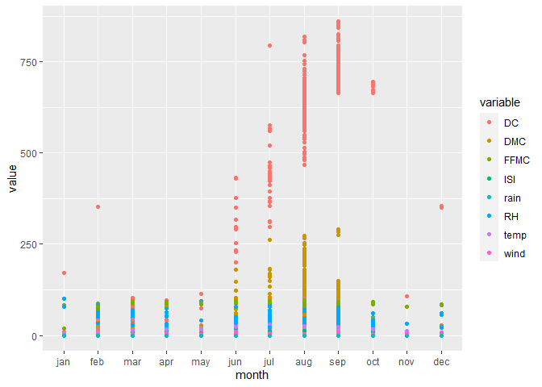

Data Visualization: Analyzing Forest Fires
================
RPrice
2023-01-18

This project will use data from a study entitled “A Data Mining Approach
to Predict Forest Fires using Meteorological Data” ([Cortez & Morais,
2007](https://www.researchgate.net/publication/238767143_A_Data_Mining_Approach_to_Predict_Forest_Fires_using_Meteorological_Data)).
The data were collected in northeast Portugal and are available
[here](https://archive.ics.uci.edu/ml/machine-learning-databases/forest-fires/).

# Initializing

``` r
rm(list=ls())
```

    ## ── Attaching packages ─────────────────────────────────────── tidyverse 1.3.2 ──
    ## ✔ ggplot2 3.4.0      ✔ purrr   1.0.1 
    ## ✔ tibble  3.1.8      ✔ dplyr   1.0.10
    ## ✔ tidyr   1.2.1      ✔ stringr 1.5.0 
    ## ✔ readr   2.1.3      ✔ forcats 0.5.2 
    ## ── Conflicts ────────────────────────────────────────── tidyverse_conflicts() ──
    ## ✖ dplyr::filter() masks stats::filter()
    ## ✖ dplyr::lag()    masks stats::lag()

Reading in the data

``` r
forestfires <- read_csv("forestfires.csv", show_col_types = FALSE)
```

``` r
head(forestfires)
```

    ## # A tibble: 6 × 13
    ##       X     Y month day    FFMC   DMC    DC   ISI  temp    RH  wind  rain  area
    ##   <dbl> <dbl> <chr> <chr> <dbl> <dbl> <dbl> <dbl> <dbl> <dbl> <dbl> <dbl> <dbl>
    ## 1     7     5 mar   fri    86.2  26.2  94.3   5.1   8.2    51   6.7   0       0
    ## 2     7     4 oct   tue    90.6  35.4 669.    6.7  18      33   0.9   0       0
    ## 3     7     4 oct   sat    90.6  43.7 687.    6.7  14.6    33   1.3   0       0
    ## 4     8     6 mar   fri    91.7  33.3  77.5   9     8.3    97   4     0.2     0
    ## 5     8     6 mar   sun    89.3  51.3 102.    9.6  11.4    99   1.8   0       0
    ## 6     8     6 aug   sun    92.3  85.3 488    14.7  22.2    29   5.4   0       0

The variables are described in the paper.

``` r
variable_matrix <- matrix(c("X", "x-axis coordinate (from 1 to 9)", "Y", "y-axis coordinate (from 1 to 9)", "month", "Month of the year (January to December)", "day", "Day of the week (Monday to Sunday)", "FFMC", "Fine fuel moisture code", "DMC", "Duff moisture code", "DC", "Drought code", "ISI", "Initial speed index", "temp", "Outside temperature (in ◦C)", "RH", "Outside relative humidity (in %)", "wind", "Outside wind speed (in km/h)", "rain", "Outside rain (in mm/m2)", "area", "Total burned area (in ha)"), ncol=2, byrow=TRUE)
colnames(variable_matrix) <- c("Variable", "Description")
rownames(variable_matrix) <- c(1:nrow(variable_matrix))
variable_table <- as.table(variable_matrix)
kable(variable_table)
```

| Variable | Description                             |
|:---------|:----------------------------------------|
| X        | x-axis coordinate (from 1 to 9)         |
| Y        | y-axis coordinate (from 1 to 9)         |
| month    | Month of the year (January to December) |
| day      | Day of the week (Monday to Sunday)      |
| FFMC     | Fine fuel moisture code                 |
| DMC      | Duff moisture code                      |
| DC       | Drought code                            |
| ISI      | Initial speed index                     |
| temp     | Outside temperature (in ◦C)             |
| RH       | Outside relative humidity (in %)        |
| wind     | Outside wind speed (in km/h)            |
| rain     | Outside rain (in mm/m2)                 |
| area     | Total burned area (in ha)               |

Fine fuel moisture code (FFMC), Duff moisture code (DMC), Drought code
(DC), and Initial speed index (ISI) are from the Canadian Forest Fire
Weather Index (FWI) System, which “consists of six components that
account for the effects of fuel moisture and weather conditions on fire
behavior” ([Natural Resources
Canada](https://cwfis.cfs.nrcan.gc.ca/background/summary/fwi)).
According to the US National Wildfire Coordinating Group, FFMC
represents the fuel moisture of forest litter that is shaded under the
tree canopy (ranges 0 to 101). DMC represents the fuel moisture of of
decomposed organic topsoil under the litter(unitless and open-ended). DC
represents deep-soil drought conditions (unitless, maximum value of
1000, with values 800 and over indicating extreme drought). ISI is a
fire behavior index. It uses wind speed and fuel moisture to estimate a
fire’s spread potential (unitless, open-ended) ([NWCG’s Fire Weather
Index
System](https://www.nwcg.gov/publications/pms437/cffdrs/fire-weather-index-system#TOC-FWI-Fuel-Moisture-Codes)).

# Data Cleaning

Checking the month and day values:

``` r
print(forestfires %>% pull(month) %>% unique)
```

    ##  [1] "mar" "oct" "aug" "sep" "apr" "jun" "jul" "feb" "jan" "dec" "may" "nov"

``` r
print(forestfires %>% pull(day) %>% unique)
```

    ## [1] "fri" "tue" "sat" "sun" "mon" "wed" "thu"

Ordering months:

``` r
month_order <- c("jan", "feb", "mar", "apr", "may", "jun",
                 "jul", "aug", "sep", "oct", "nov", "dec")
forestfires <- forestfires %>% mutate(month = factor(month, levels=month_order))
forestfires %>% pull(month) %>% unique
```

    ##  [1] mar oct aug sep apr jun jul feb jan dec may nov
    ## Levels: jan feb mar apr may jun jul aug sep oct nov dec

Ordering days of the week:

``` r
day_order <- c("mon", "tue", "wed", "thu", "fri", "sat",
                 "sun")
forestfires <- forestfires %>% mutate(day = factor(day, levels=day_order))
forestfires %>% pull(day) %>% unique
```

    ## [1] fri tue sat sun mon wed thu
    ## Levels: mon tue wed thu fri sat sun

# Data Visualization

Two questions: \* In which months do forest fires happen the most? \* On
which days of the week do forest fires happen the most?

## In which months do forest fires happen the most?

Count the number of forest fires per month:

``` r
fires_monthly <- forestfires %>% group_by(month) %>% summarize(count=n())
fires_monthly
```

    ## # A tibble: 12 × 2
    ##    month count
    ##    <fct> <int>
    ##  1 jan       2
    ##  2 feb      20
    ##  3 mar      54
    ##  4 apr       9
    ##  5 may       2
    ##  6 jun      17
    ##  7 jul      32
    ##  8 aug     184
    ##  9 sep     172
    ## 10 oct      15
    ## 11 nov       1
    ## 12 dec       9

Visualization:

``` r
fires_monthly %>% ggplot(aes(x=month, y=count)) +
                         geom_col(fill = "dark red") +
                         labs(title = "Forest Fires Per Month",
                               x = "Month", y = "Total Fires") 
```

<!-- -->

The months with the most forest fires are August and September, with
close to 175 fires.

## On which days of the week do forest fires happen the most?

Count the number of forest fires per day:

``` r
fires_daily <- forestfires %>% group_by(day) %>% summarize(count=n())
fires_daily
```

    ## # A tibble: 7 × 2
    ##   day   count
    ##   <fct> <int>
    ## 1 mon      74
    ## 2 tue      64
    ## 3 wed      54
    ## 4 thu      61
    ## 5 fri      85
    ## 6 sat      84
    ## 7 sun      95

Visualization:

``` r
fires_daily %>% ggplot(aes(x=day, y=count)) +
                         geom_col(fill = "dark red") +
                         labs(
                           title = "Forest Fires By Day of the Week",
                               x = "Day", y = "Total Fires") 
```

<!-- -->
There is a slightly higher number of forest fires per day on the
weekends, Friday through Sunday.

## Creating long data

Next, I will use plots to visualize how variables change over the
months. We are interested in eight variables:

``` r
variable_matrix[5:12, 1:2]
```

    ##    Variable Description                       
    ## 5  "FFMC"   "Fine fuel moisture code"         
    ## 6  "DMC"    "Duff moisture code"              
    ## 7  "DC"     "Drought code"                    
    ## 8  "ISI"    "Initial speed index"             
    ## 9  "temp"   "Outside temperature (in ◦C)"     
    ## 10 "RH"     "Outside relative humidity (in %)"
    ## 11 "wind"   "Outside wind speed (in km/h)"    
    ## 12 "rain"   "Outside rain (in mm/m2)"

Creating long data:

``` r
forestfires_long <- forestfires %>%
pivot_longer(cols = c(FFMC, DMC, DC, ISI, temp, RH, wind, rain), names_to = "variable", values_to = "value")
```

Plotting multiple variables:

``` r
forestfires_long %>% ggplot(
  aes(x = month, y = value, color = variable)) +
  geom_point()
```

<!-- -->
The data is too cramped to read on a single plot, so I will make
multiple subplots.

``` r
#theme_set(theme_gray())
theme_set(theme_light())
#trying to make title background white
title_theme <- theme_update(strip.background = element_rect(fill = "grey20", color = "grey20"))
#theme_set(title_theme) why don't you need this

new_titles <- c("Fine fuel moisture code", "Duff moisture code", "Drought code", "Initial speed index", "Temperature (◦C)", "Relative humidity (%)", "Wind speed (km per h)", "Rain (mm per square m)")
#subplots can have an individual title or ylab, not both
names(new_titles) <- c("FFMC", "DMC", "DC", "ISI", "temp", "RH", "wind", "rain")


forestfires_long %>% ggplot(
  aes(x = month, y = value)) +
  geom_point(shape = 20) +
  facet_wrap(vars(variable), scales = "free_y", 
             labeller = as_labeller(new_titles)) + #new subplot titles
  scale_x_discrete(labels=c("jan", "", "mar", "", "may", "","jul", "",  
                            "sep", "", "nov", "")) + #label 6 months
  ylab("") + #removing unnecessary "value" label
  theme(axis.text.x = element_text(size=9, angle = -40, vjust = 0.5, hjust = 0, color = "black") # rotate and move x tick labels (months)
        ) 
```

<!-- -->

Recall that DMC and ISI are unitless and open-ended. FFMC ranges from 0
to 101. DC has a maximum value of 1000, with values 800 and up
indicating extreme drought. DC increases steadily throughout the summer,
peaking in September. It looks like the max values are close to the
extreme drought value in August and September. Temperature peaks in
August. Interestingly, DMC appears to increase in the warmer months.
There is a single very high rain value in August. Wind speed appears to
decrease slightly in the fall and winter. ISI, related to wind speed but
also to fuel moisture, peaks in August. As next steps, we can look more
closely at variables that may be most closely related to increased
wildfires in August and September: temperature, DC, and ISI. I would
also like to repeat the rain graph without the outlier.

Selecting the top five fires with highest rain values:

``` r
forestfires %>% slice_max(rain, n = 5)
```

    ## # A tibble: 5 × 13
    ##       X     Y month day    FFMC   DMC    DC   ISI  temp    RH  wind  rain  area
    ##   <dbl> <dbl> <fct> <fct> <dbl> <dbl> <dbl> <dbl> <dbl> <dbl> <dbl> <dbl> <dbl>
    ## 1     7     5 aug   tue    96.1  181.  671.  14.3  27.3    63   4.9   6.4 10.8 
    ## 2     5     4 aug   fri    91    167.  753.   7.1  21.1    71   7.6   1.4  2.17
    ## 3     7     4 aug   sun    91.8  175.  701.  13.8  21.9    73   7.6   1    0   
    ## 4     8     6 aug   tue    96.1  181.  671.  14.3  21.6    65   4.9   0.8  0   
    ## 5     7     5 aug   tue    96.1  181.  671.  14.3  21.6    65   4.9   0.8  0

The maximum rainfall is 6.4 mm/m2, and the next highest value is 1.4. It
is a statistical outlier but is not impossible. The drought code is
still very high for that incident. Let’s make a larger rain graph to see
the values more easily:

``` r
forestfires %>% ggplot(aes(x = month, y = rain)) +
                         geom_point(shape = 20) +
                         labs(title = "Rainfall")
```

<!-- -->

The plot shows rain occuring during fire incidents only once in March
and July, five times in August. There was no rainfall during fires in
any other months. The drought code is highest in the summer months,
making it unlikely that this location experiences regular summer rain.
Britannica indicates that Portugal has variable rainfall, but inland
regions experience summer drought ([Britannica, Climate of
Portugal](https://www.britannica.com/place/Portugal/Climate)). With that
background, the data may indicate that during the winter months,
conditions are wet enough that fires occur only on the driest days.
However, in the summer, drought may be intense enough that fires are
able to establish and spread in dry fuel even during rainfall.
